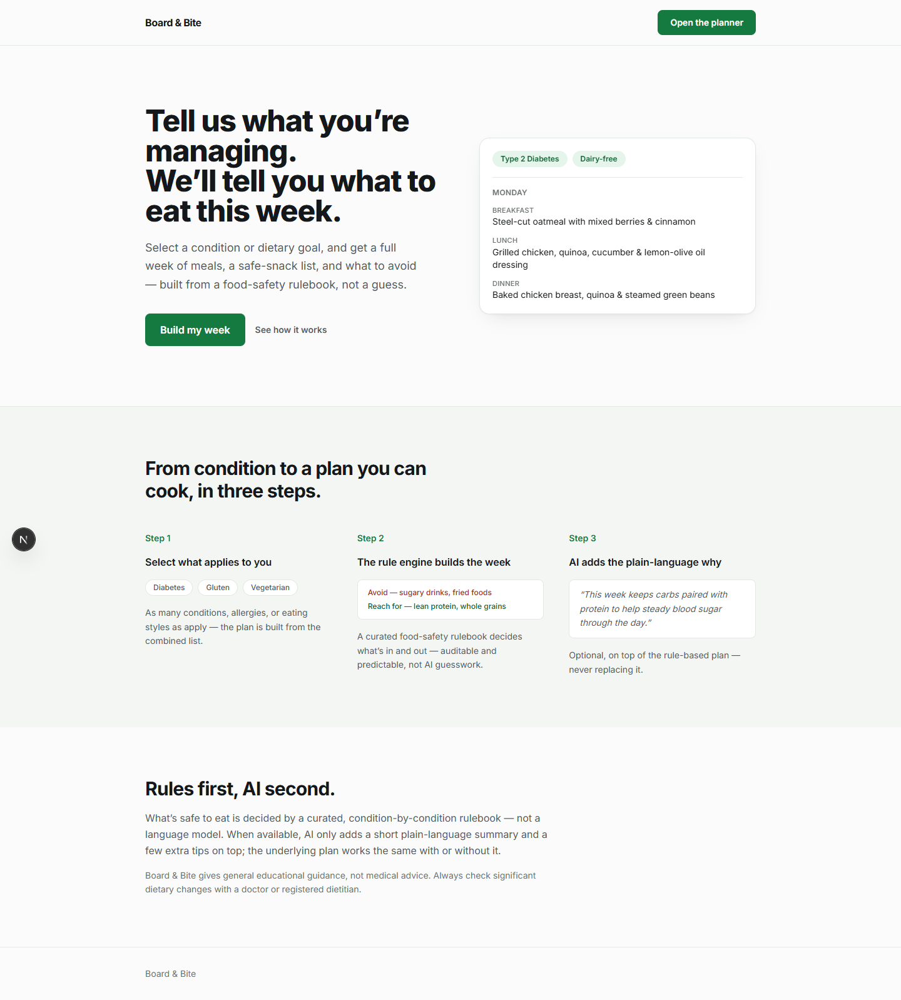
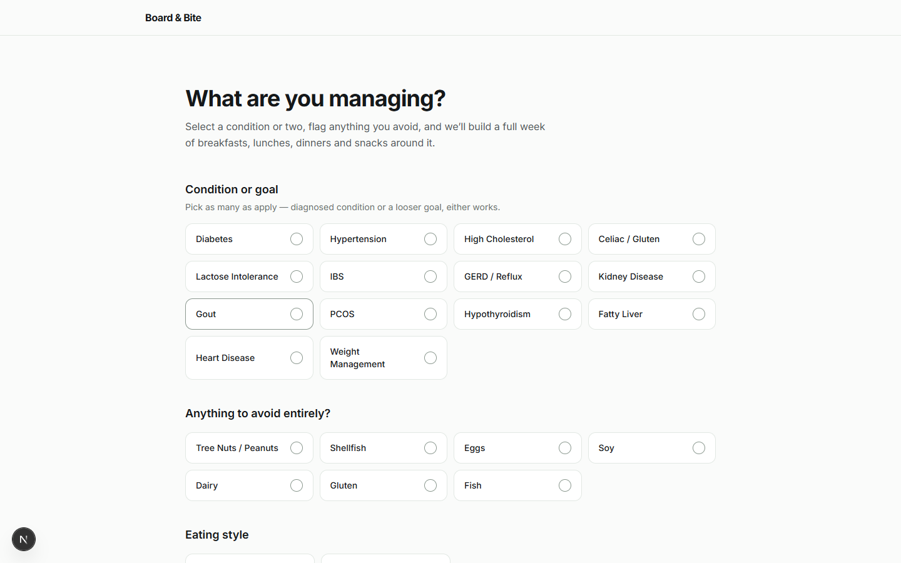
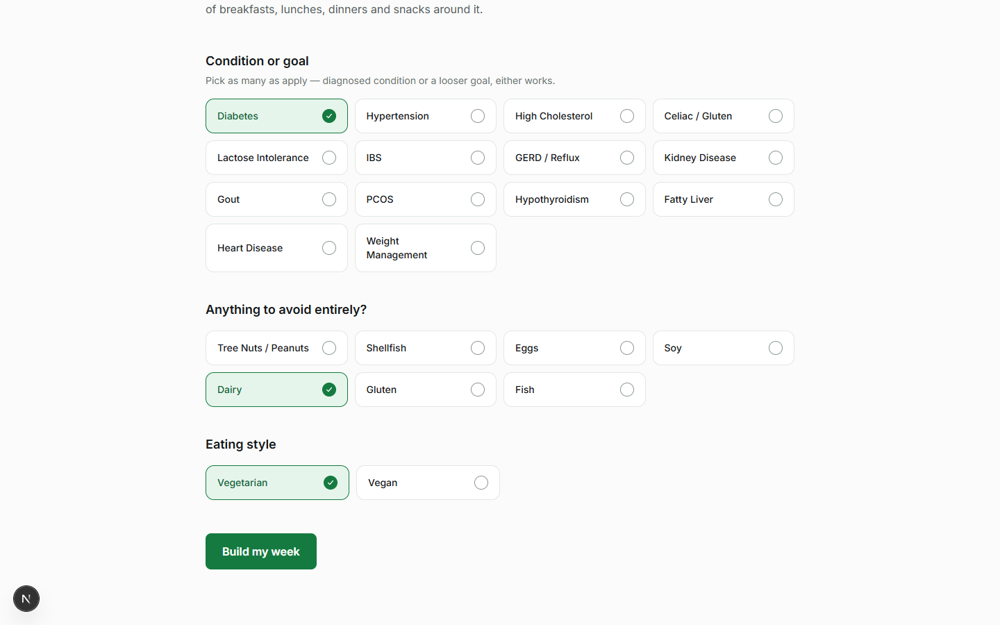
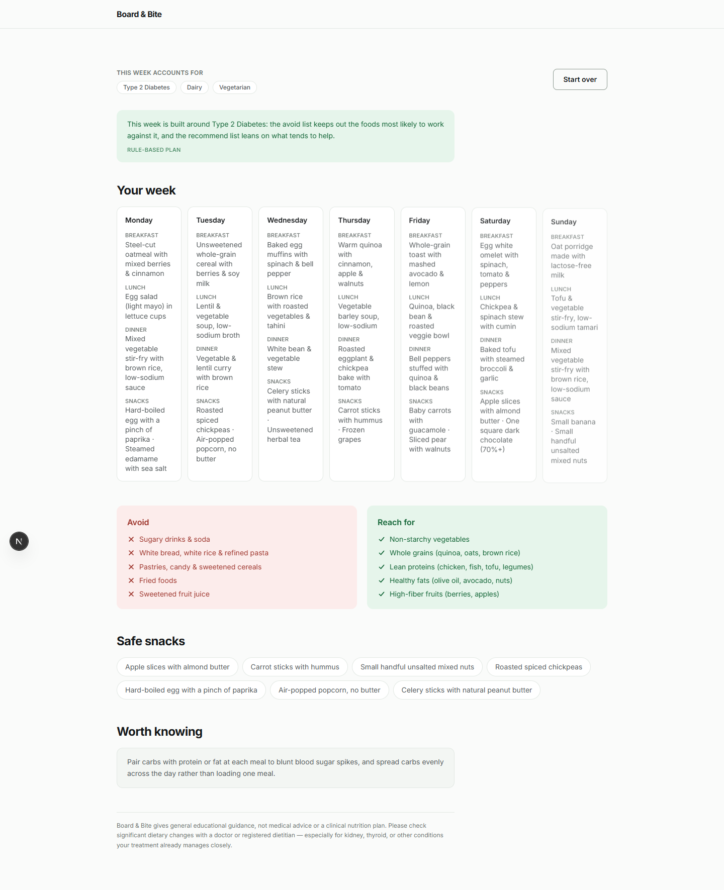
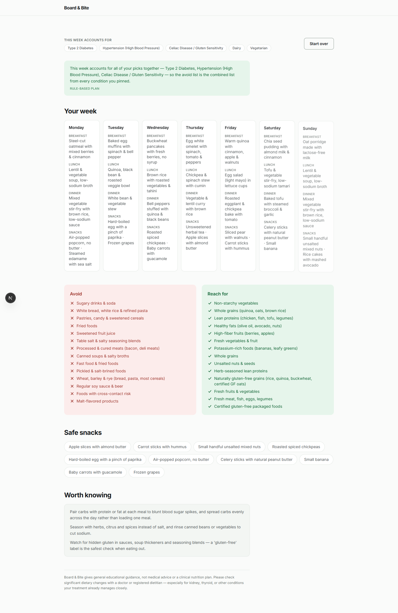
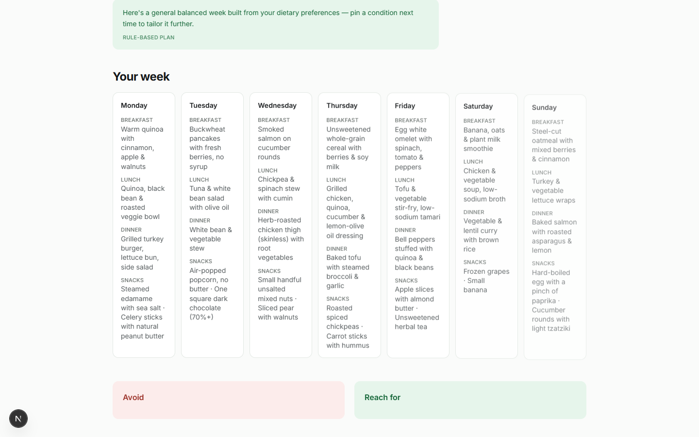
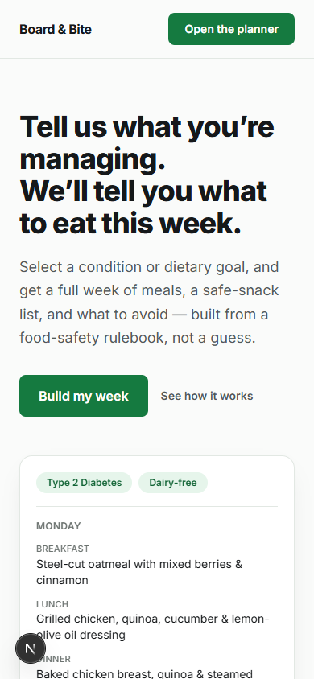

# Board & Bite

Board & Bite is a Next.js app that turns a health condition or dietary goal into a
full seven-day meal plan. Pick one or more conditions (diabetes, hypertension, celiac,
IBS, and about a dozen others), flag any allergies or an eating style like vegetarian,
and it generates a week of breakfasts, lunches, dinners, and snacks, plus an avoid list
and a recommend list built around what you selected. There's no sign-up and no
database — every plan is generated on the spot from a static rule set, and nothing is
saved between visits.

## Screenshots

<table>
  <tr>
    <td></td>
    <td></td>
  </tr>
  <tr>
    <td align="center">Landing page</td>
    <td align="center">Condition/allergy/preference picker</td>
  </tr>
  <tr>
    <td></td>
    <td></td>
  </tr>
  <tr>
    <td align="center">Form with selections made</td>
    <td align="center">Generated week for a single condition</td>
  </tr>
  <tr>
    <td></td>
    <td></td>
  </tr>
  <tr>
    <td align="center">Combined plan for several conditions at once</td>
    <td align="center">Fallback general week when nothing is selected</td>
  </tr>
  <tr>
    <td></td>
    <td></td>
  </tr>
  <tr>
    <td align="center">Landing page at mobile width</td>
    <td></td>
  </tr>
</table>

## How the plan gets built

The core logic lives in `src/lib/planGenerator.ts` and `src/lib/data/`. Each condition
in `conditions.ts` carries an `avoidTags`/`preferTags` list, an explicit `avoidList`/
`recommendList` for display, and a set of snack IDs. Allergies (`allergies.ts`) map to
an `Allergen` and strip any food carrying that tag out of the pool entirely; eating
styles in `preferences.ts` work the same way for meat/seafood/dairy/egg. When multiple
conditions are selected, their avoid tags are unioned, so the generated week has to
satisfy every constraint at once rather than picking one condition to prioritize.

The food pool itself (`src/lib/data/foods.ts`) is a small curated list of meals and
snacks tagged with the same tag vocabulary the conditions use. The generator filters
that pool down to what's allowed, then assembles seven days from what's left. If a
condition's constraints are narrow enough that the generator runs short on distinct
options for a slot, it notes that in `plan.degraded` and the results page surfaces it
as "a couple of notes on this plan" rather than silently repeating meals without
explanation.

Everything above is deterministic and works with no external services. Optionally, if
a `GEMINI_API_KEY` is set (see `.env.local.example`), `src/lib/gemini.ts` sends the
already-decided avoid/recommend lists to Gemini and asks it to write a short plain-
language summary and a few extra tips on top — it's never allowed to change what's
actually in the plan, only to add tone. Without a key, the app falls back to a
template-generated summary and skips the AI tips, and the results page labels the
plan "Rule-based plan" instead of "Written with Gemini." No Gemini key is configured
in this environment, so all of the screenshots above show the rule-based fallback
path rather than the AI-enhanced one.

## Stack

- Next.js 16 (App Router) with TypeScript
- React 19
- Tailwind CSS v4
- One API route (`src/app/api/generate-plan`) that runs the rule engine server-side
  and optionally calls Gemini
- No database, no auth, no persistence — state lives in React on the `/plan` page for
  the current session only

## Project structure

```
src/
  app/
    page.tsx                 landing page
    plan/page.tsx             the picker + results flow
    api/generate-plan/route.ts  plan generation endpoint
  components/                 form controls, day cards, avoid/recommend callouts
  lib/
    planGenerator.ts          rule engine
    gemini.ts                 optional AI summary layer
    data/                     conditions, allergies, preferences, food pool
```

## Running locally

```bash
npm install
npm run dev
```

The app runs on `http://localhost:3000` by default. To enable the AI summary layer,
copy `.env.local.example` to `.env.local` and set `GEMINI_API_KEY`; everything works
without it.

## Notes

This is a personal/portfolio project. The condition and food data was authored for
this build as general educational content — it isn't sourced from clinical
literature, and the app says so on the results page. It isn't medical advice, and
the UI states that directly rather than treating it as a disclaimer footnote.
